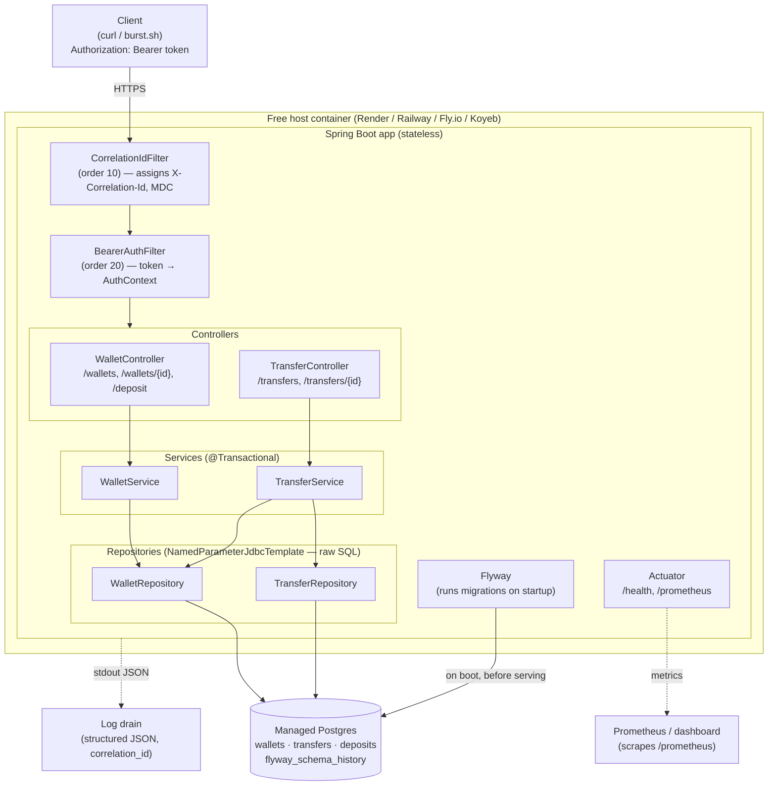
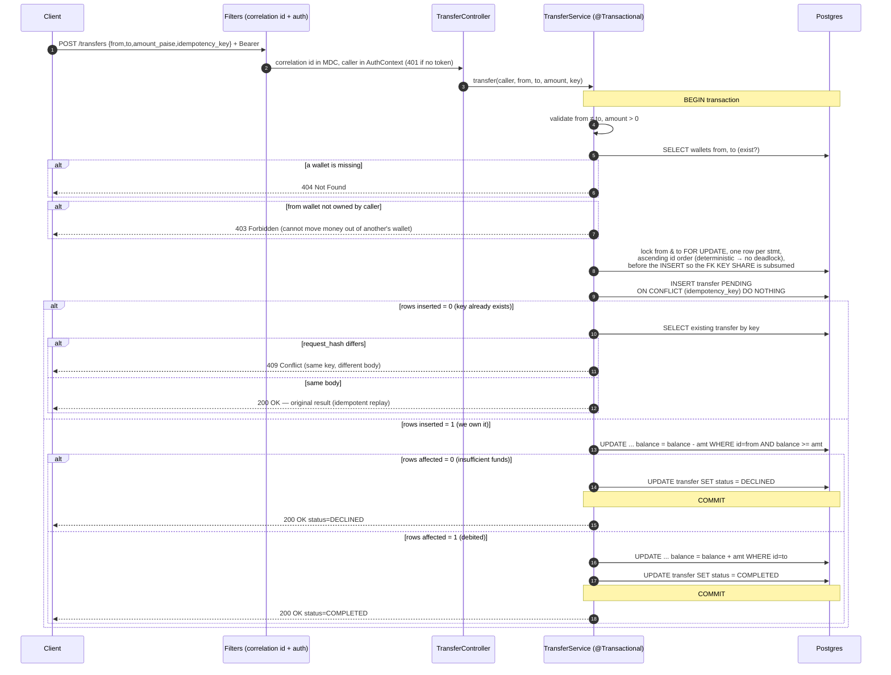
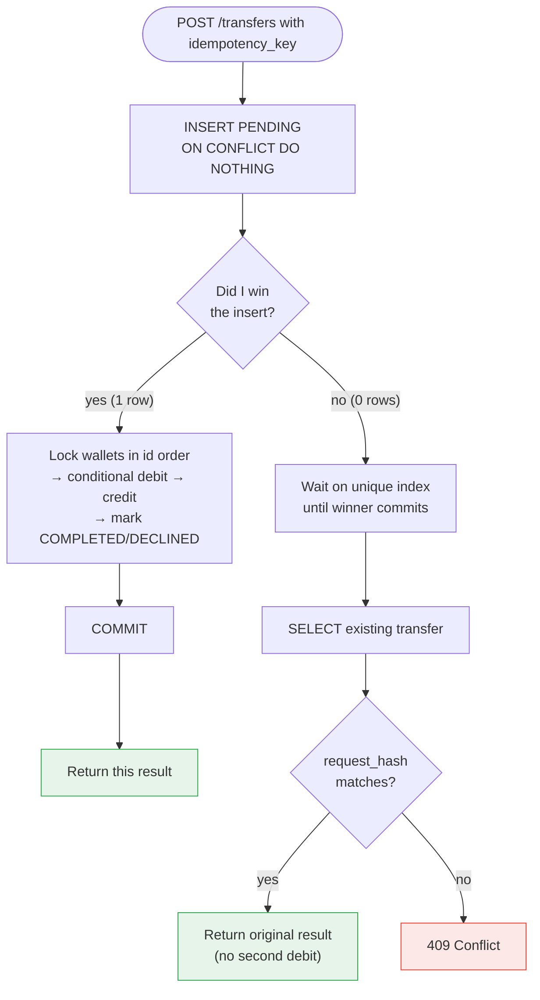
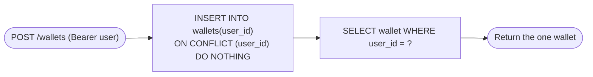
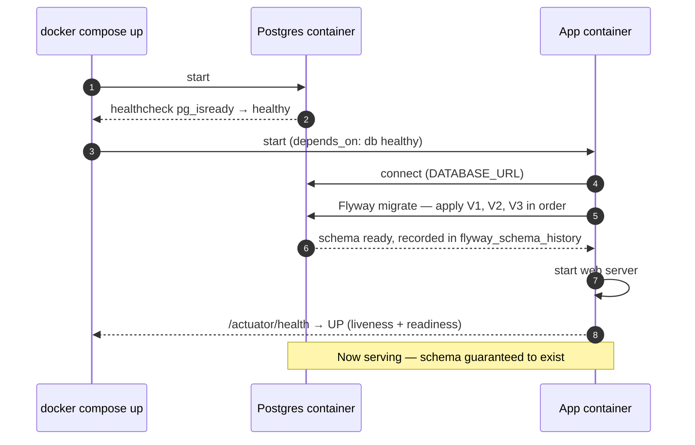
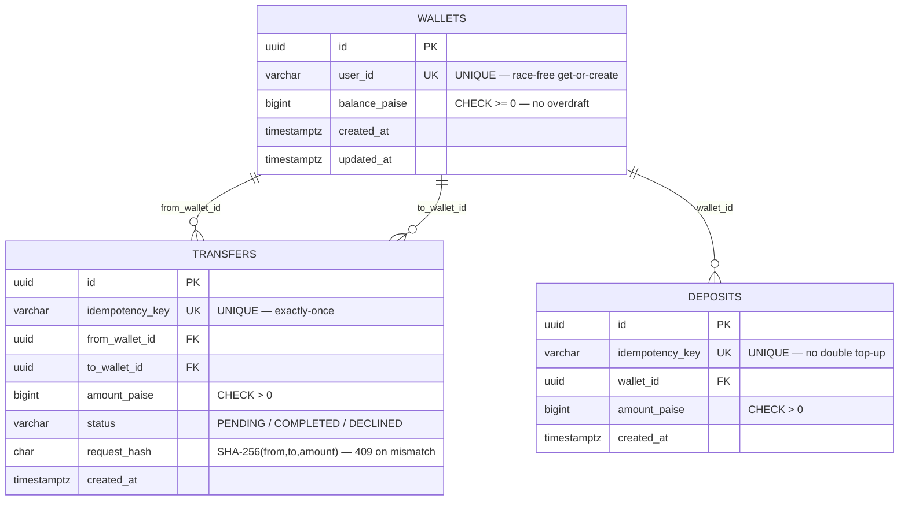

# Architecture & Flow

End-to-end design of the Wallet & P2P Transfer service. Diagrams are Mermaid and
render directly on GitHub.

## 1. System / deployment architecture

How the pieces fit together when deployed on a free host with managed Postgres.

Everything correct lives in the database (constraints + locks); the app layer is
stateless and can be scaled horizontally.

## 2. Transfer flow — exactly-once, conservation, no-overdraft

The full path of a `POST /transfers`, all inside one READ COMMITTED transaction.

## 3. Idempotency decision (why a retry storm is safe)

What each of K concurrent requests with the *same* key does.

The unique constraint on `idempotency_key` means exactly one request wins; every
other request reads the winner's committed result — so money moves once.

## 4. Get-or-create wallet (race-free)

The `UNIQUE(user_id)` constraint + `ON CONFLICT` means 50 concurrent calls for a
brand-new user still produce exactly one wallet.

## 5. Startup sequence (containers + migrations)

What `docker compose up` does, and why the app is correct the instant it is healthy.

## Data model (entity relationships)

